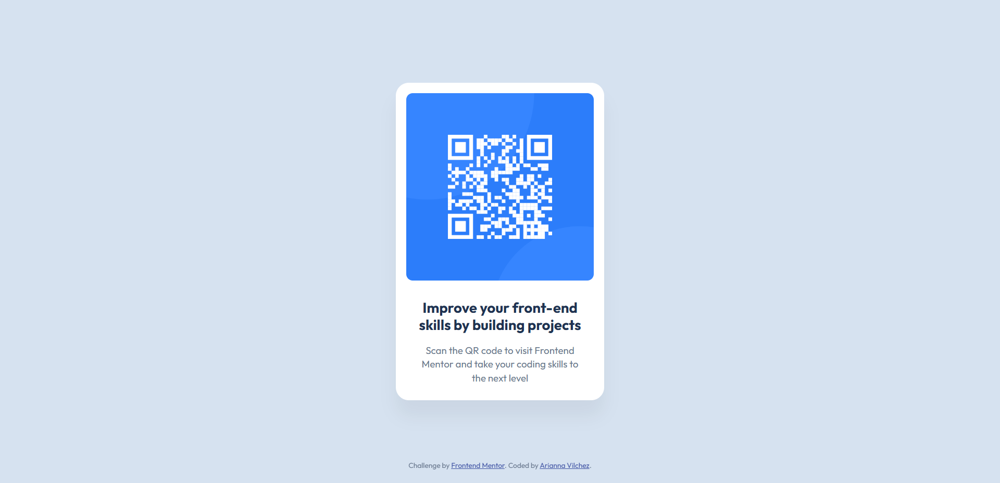

# Frontend Mentor - QR code component solution

This is a solution to the [QR code component challenge on Frontend Mentor](https://www.frontendmentor.io/challenges/qr-code-component-iux_sIO_H). Frontend Mentor challenges help you improve your coding skills by building realistic projects. 

## Table of contents

- [Overview](#overview)
  - [Screenshot](#screenshot)
  - [Link](#link)
- [My process](#my-process)
  - [Built with](#built-with)
  - [What I learned](#what-i-learned)
  - [Continued development](#continued-development)
- [Author](#author)

## Overview

Challenge to try and copy a screenshot of a QR Code as close as possible using HTML and some CSS.

### Screenshot

Screenshot of the completed challenge:



### Link

 - [Live site URL](https://arikiller.github.io/QR-Code-Challenge-FrontendMentor/)

## My process

First I started with the estructure doing the HTML, then I did the css file to make the style as close as possible to the screenshot.

Making some div classes to try and find how to make the layout as close as possible to the preview. 

Finding out that when you make a div class, all the elements you use like h1, p, etc... You can add style to that by specifing using, for example, if the div class is named qr in my case, you just do .qr h1, and in brackets add the style you want it to have. Pretty useful.

Started trying a lot of different things to make the style as close as possible, finally figuring some things out and seeing progress. After some changes finally was able to make it happen. Happy with the result.

### Built with

- Semantic HTML5 markup
- CSS custom properties

### What I learned

Using div classes to add style to everything easier and trying to make work the fonts of google.

For style finding out that * allows to set everything in a certain way, perfect to set the layout easier.

Learning what each property of style does and finally was able to change the style the way I wanted and not having to change randomly praying for some luck.

Some css below that I did to make it look like the preview.

```css
* {
  margin: 0;
  padding: 0;
  box-sizing: border-box;
}

body {
  background-color: hsl(212, 45%, 89%);
  font-family: 'Outfit', sans-serif;
  font-size: 15px;
  display: flex;
  justify-content: center;
  align-items: center;
  min-height: 100vh;
  padding: 20px;
}

.qr {
  width: 320px;
  max-width: 100%;
  text-align: center;
  box-shadow: 0 25px 25px rgba(0, 0,0,0.05);
  padding: 16px;
  background-color: white;
  border-radius: 20px;
}
```

### Continued development

I would want to keep evolving in my use of HTML and CSS and I believe is very green still, but after this I notice is not as difficult as I thought, and its pretty entertaining.

I will continue to find challenges like this one to improve my skills.

## Author

- GitHub - [AriKILLER](https://github.com/AriKILLER)
- Frontend Mentor - [@AriKILLER](https://www.frontendmentor.io/profile/AriKILLER)
- Discord - [@Ari_KILLER]
